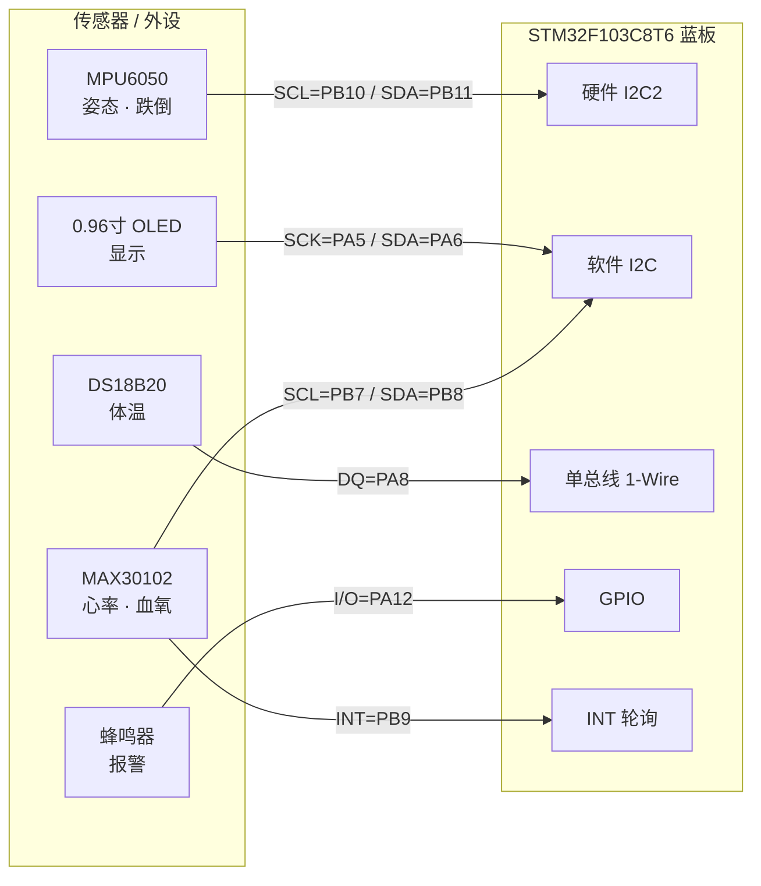

<div align="center">

# 小组嵌入式 · STM32 健康监测

**STM32F103C8T6（蓝板）心率 + 血氧 + 体温 + 跌倒检测** · 复用正点原子标准库工程

</div>

基于 [B站 `BV1mT421a79w`](https://www.bilibili.com/video/BV1mT421a79w)（UP：嵌入式学习君）开源源码二次整理，补全仓库级文档、Mermaid 原理图与一键编译脚本。

## 功能一览

| 模块 | 器件 | 关键引脚 | 说明 |
|------|------|----------|------|
| 心率 / 血氧 | MAX30102 | SCL=PB7, SDA=PB8, INT=PB9 | 软件 I2C，Maxim 算法，500 点缓冲 |
| 体温 | DS18B20 | DQ=PA8 | 单总线，整数度 |
| 姿态 / 跌倒 | MPU6050 | SCL=PB10, SDA=PB11 | 硬件 I2C2 | 
| 显示 | 0.96" OLED | SCK=PA5, SDA=PA6 | 中文字库 |
| 报警 | 有源蜂鸣器 | I/O=PA12 | GPIO 驱动 |
| (预留) | ESP32 第二主板 | USART1(PA9/PA10) | 数据上传/联网 |

## 系统接线图

> GitHub 原生支持 Mermaid，此处可直接渲染；完整方案（含电源/上拉/搭建清单）见 [board/schematic.md](board/schematic.md)。



## 目录结构

```
小组嵌入式/
├─ board/           接线与原理图（Mermaid） + 组件清单图组件部分.png
├─ docs/            架构说明、算法分析、ESP32 集成方案
├─ firmware/
│  └─ MAX30102/     正点原子标准库 Keil 工程（USER/IIC.uvprojx）
├─ scripts/
│  └─ build.ps1     一键编译脚本 → firmware/MAX30102/OBJ/IIC.hex
├─ README.md
└─ LICENSE
```

## 快速开始（编译）

需要 Keil MDK v5（V5.06 编译器已测）+ STM32F1xx DFP。

```powershell
powershell -ExecutionPolicy Bypass -File scripts\build.ps1
```

产物：`firmware\MAX30102\OBJ\IIC.hex`（首行 `:020000040800F2`，烧录地址 0x0800 0000）。
编译结果：`0 Error(s), 2 Warning(s)`（原代码遗留的未使用变量，无影响）。

## 说明

- firmware 内驱动/CORE/FWLib 源自正点原子(ALIENTEK)，其版权头注"仅供学习使用"，本仓库仅作学习整理。
- 完整接线与原理图见 [board/schematic.md](board/schematic.md)，硬件搭建前请先核对 OLED 接口类型与蜂鸣器是否有源。