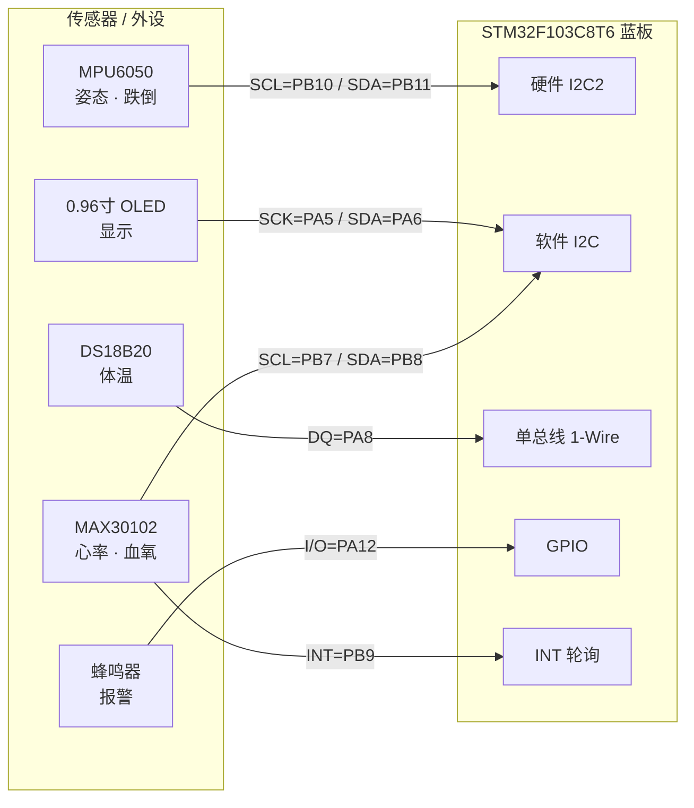

# 接线与原理图

> 组件清单图见 [组件部分.png](./组件部分.png)。本文件给出逐引脚接线表与系统级 Mermaid 原理图。

## 1. 接线表

全部器件 **3.3V** 逻辑与供电，共地。

| 器件 | 引脚 | → STM32F103C8T6 | 备注 |
|------|------|-----------------|------|
| **MAX30102** 心率血氧 | VCC | 3.3V | |
| | GND | GND | |
| | SCL | PB7 | 软件 I2C 时钟 |
| | SDA | PB8 | 软件 I2C 数据 |
| | INT | PB9 | 轮询（非中断）采样就绪 |
| **0.96" OLED** | VCC | 3.3V | SSD1306 |
| | GND | GND | |
| | SCK | PA5 | 软件 SPI/I2C 时钟 |
| | SDA | PA6 | 数据 |
| **MPU6050** 姿态 | VCC | 3.3V | |
| | GND | GND | |
| | SCL | PB10 | 硬件 I2C2 时钟 |
| | SDA | PB11 | 硬件 I2C2 数据 |
| **DS18B20** 温度 | VCC | 3.3V | |
| | GND | GND | |
| | DQ | PA8 | 单总线，需上拉 |
| **蜂鸣器**（有源） | VCC | 3.3V | |
| | GND | GND | |
| | I/O | PA12 | GPIO 高电平驱动 |

> **注意**：`PA12` 同时是 USB_DP。作 GPIO 使用后蓝板 USB 口不再用于 USB 通信（烧录用 SWD/JLINK 即可）。

## 2. 系统原理图（Mermaid）

## 3. 电源与信号完整性

- 供电：5V（USB/面包板）→ 蓝板 AMS1117 → **3.3V**，整机功耗约 50–80mA 典型，蜂鸣器按 20–30mA 计入，余量充足。
- 上拉：两条软件 I2C（PB7/PB8、PA5/PA6）与 DS18B20 DQ 需 4.7kΩ 上拉；多数成品模块已板载，**搭板前需核实**。
- 蜂鸣器若为无源（需 PWM 频率驱动），PA12 无定时器通道，需改接到 TIM 通道引脚（如 PA8/PA9/PA10 等），本工程按有源蜂鸣器编写。

## 4. 硬件搭建前确认清单

- [ ] OLED 是 4 针(I2C) 还是 7 针(SPI)，驱动是否匹配
- [ ] 蜂鸣器有源/无源
- [ ] 各模块板载上拉是否存在
- [ ] 蓝板晶振（8MHz HSE）与固件 `system_stm32f10x.c` 配置一致（本工程按 72MHz 主频）