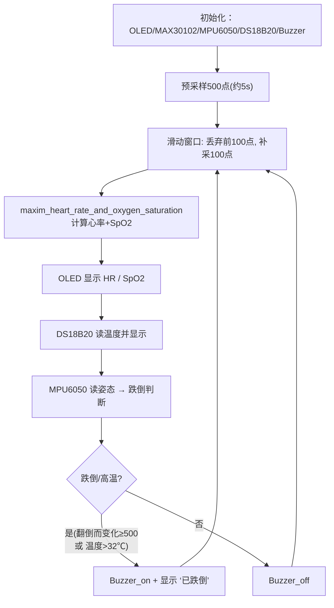

# 架构设计

> 硬件事项见 [board/schematic.md](../board/schematic.md)。本文件说明固件架构、数据流、跌倒算法与 ESP32 扩展方案。

## 1. 技术基线

- 主控：**STM32F103C8T6**（蓝板/最小系统，64KB Flash），**72MHz**（8MHz HSE ×9 倍频）。
- 代码基线：**正点原子标准外设库(SPL)** Keil 工程（`firmware/MAX30102`，工程名 `IIC`）。
  - 编译器 V5.06，器件 STM32F103C8，`CreateHexFile=1`，输出 `OBJ/IIC.hex`。
- 本机构建产物/交接物：**Hex** 首行 `:020000040800F2`，目标 Flash `0x0800 0000`。

## 2. 目录职责

```
firmware/MAX30102/
├─ CORE/              Core 启动：core_cm3、startup_stm32f10x_md.s（medium density）
├─ HARDWARE/          板级驱动（本项目核心，均相对 USER 引用）
│  ├─ BUZZER/         有源蜂鸣器 Buzzer.c/.h
│  ├─ DS18B20/        单总线温度 ds18b20.c/.h
│  ├─ IIC/            软件 I2C + MAX30102 + Maxim 算法
│  │   ├─ myiic.c     软件 I2C 时序（动手写）
│  │   ├─ max30102.c  MAX30102 驱动（FIFO 读、寄存器初始化）
│  │   └─ algorithm.c 心率/SpO2 计算算法（Maxim）
│  ├─ LED/            （未用）板载灯驱动
│  ├─ MPU6050/        MPU6050 驱动（含寄存器定义）
│  └─ OLED/           SSD1306 软驱动 + 中文字库（OELD_Data.c）
├─ STM32F10x_FWLib/   正点原子标准库 3.5
├─ SYSTEM/            delay / sys / timer / usart（正点原子底层）
├─ USER/              main.c + Keil 工程 IIC.uvprojx
└─ OBJ/               编译产物（.axt/.hex/.o，已 gitignore）
```

## 3. 主循环数据流（`USER/main.c`）



### 时序要点
- 心率采样为**阻塞式轮询** `while(MAX30102_INT==1)`，100 sps × 500 点缓冲 → 每 5s 出一次结果，非实时连续。
- OLED 整屏 `OLED_Update()` 刷新，与采样循环交替执行。

## 4. 跌倒检测算法（现状与改进）

**现状（原源码）**：仅用 MPU6050 的 `AX/AY` 变化量做阈值判断（增量 ≥500 判跌倒），且把"贴体温 ≥32℃"当作预警。

```c
if (Last_AX - AX >=500 || AX - Last_AX >=500 || Last_AY - AY >=500 || AY - Last_AY >=500)
    // 判定跌倒 → Buzzer_on
else if (Temp > 32)   // 用户体表温度过高 → 预警
    // Buzzer_on
```

**缺点**：忽略 Z 轴与角速度 GZ；仅看单次增量易误判；未做自由落体/撞击/躺卧的三段式判别。

**改进建议（后续迭代）**：
1. 加速度模长 `|a| = sqrt(AX²+AY²+AZ²)`，做 **自由落体**(|a|≈0)→**撞击峰**(>2.5g)→**姿态躺卧** 三段状态机。
2. 引入 GZ 角速度与 DMP/归一化方向，判别站立 vs 平躺差异。
3. 去抖动（连续 N 帧确认）与报警自动复位/提示确认，降低误报。

## 5. ESP32 第二主板集成（预留）

- 目前 `USART1(PA9/PA10)` **未占用**，仅启用 `SYSTEM/usart` 底层，便于作为 STM32→ESP32 的数据链路。
- 建议格式：每周期输出一行 `CSV` 或 `JSON`，例如：

```
{"bpm":75,"spo2":98,"temp":36.5,"fall":0}
```

- ESP32 侧可负责 WiFi/蓝牙、云平台上报、App 推送；STM32 仅做采集与本地报警。

## 6. 构建

```powershell
powershell -ExecutionPolicy Bypass -File scripts\build.ps1
```

结果：`0 Error(s), 2 Warning(s)`（`main.c` 中 `temp_num`、`str` 未使用，原代码遗留，无功能影响）。

## 7. 已知注意点

- `MAX30102` 采用软件 I2C（`PBout(7)/PBout(8)`），对引脚翻转时序要求高，改动时勿直接换硬件 I2C1（PB7/PB8 不是合法 I2C1 组合）。
- 采样为阻塞轮询，主循环整体占满，实时性有限；如需与 ESP32 同时工作，建议把采样改到中断/定时器节拍。

## 8. TODO / 待办

> 按优先级排列；勾选即表示已推进。硬件事项的前提见 [board/schematic.md](../board/schematic.md) 的「搭建前确认清单」。

- [ ] **跌倒算法改进**：当前仅 AX/AY 增量阈值 + 高温预警，误判多。改为三段式状态机：自由落体(|a|≈0) → 撞击峰(>2.5g) → 姿态躺卧，派生成 `GZ` 角速度并使用连续 N 帧去抖。
- [ ] **心跳采样改造**：从阻塞轮询(100sps/500点)改为中断/定时器节拍驱动，摆脱"每 5s 才更新"的阻塞，便于实时刷新。
- [ ] **清零 CPU 占用**：`MAX30102` 软件 I2C 主循环占满，需评估加入空闲节拍。
- [ ] **ESP32 第二主板打通**：利用预留 USART1(PA9/PA10)，按 CSV/JSON 格式上行
      `{"bpm":75,"spo2":98,"temp":36.5,"fall":0}`；ESP32 侧负责 WiFi/云上报/App 推送。
- [ ] **消除编译告警**：清理 `main.c` 中未使用的 `temp_num`、`str`，将 `0 Error, 2 Warning` 收敛到 0 警告。
- [ ] **配置校验表落地**：实测确认 OLED 接口类型(4针I2C/7针SPI)、蜂鸣器有源/无源、各模块上拉后回填 `board/schematic.md`。